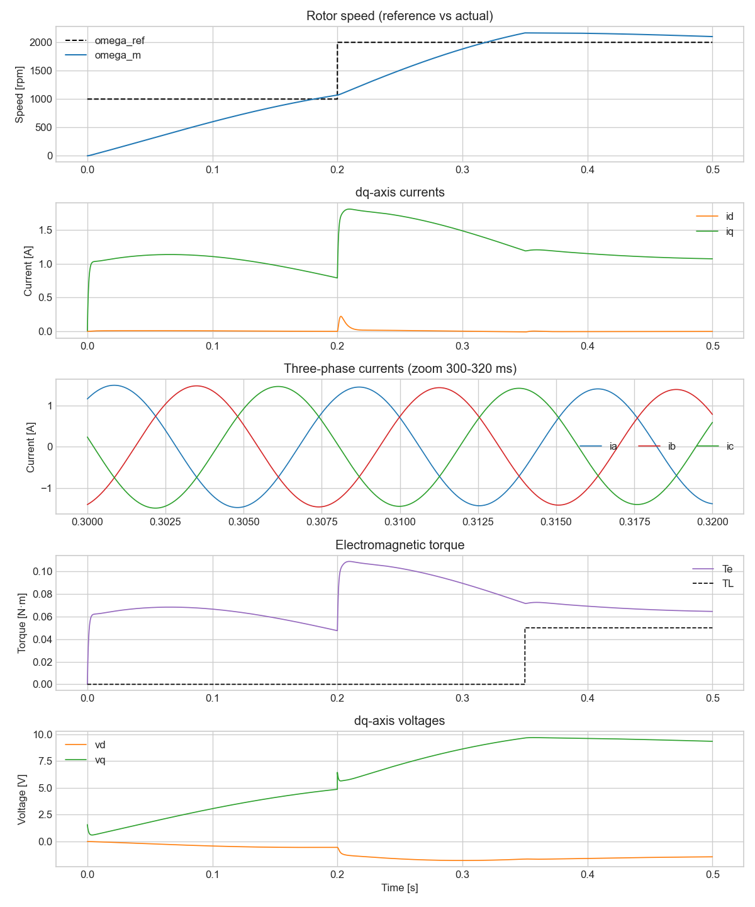

# Three-Phase Inverter — BLDC Motor Vector Control

Python numerical simulation of **field-oriented control (FOC)** for a three-phase
BLDC (SPM) motor driven by a three-phase inverter with space-vector PWM.
Implements Clarke/Park transforms, SVPWM, and cascaded PI loops (speed + d/q current).

## Features

- Clarke / Park transforms (amplitude-invariant) and their inverses
- Space-vector PWM (SVPWM) with min/max common-mode injection
- Cascaded PI FOC: speed → iq reference, id/iq → vd/vq
- Voltage-circle saturation and conditional-integration anti-windup
- `id_ref = 0` control suitable for surface-PMSM / BLDC
- dq-frame motor model with electromagnetic torque (including reluctance term)

## Example output



## Quick start

```bash
pip install -r requirements.txt
python simulation.py
```

The driver runs a speed step (1000 → 2000 rpm at t = 0.2 s) and a load-torque
step (0 → 0.05 N·m at t = 0.35 s), then writes `foc_simulation.png` with five
panels: rotor speed, dq currents, three-phase currents (zoomed), electromagnetic
torque, and dq voltages.

## Project layout

```
.
├── bldc/
│   ├── __init__.py
│   ├── motor.py         # BLDCMotor (dq-frame model)
│   ├── inverter.py      # ThreePhaseInverter + SVPWM
│   ├── transforms.py    # Clarke / Park / inverses
│   └── controller.py    # PIController / FOCController
├── simulation.py        # closed-loop simulation driver
├── plots.py             # matplotlib visualization
├── requirements.txt
└── README.md
```

## Default motor parameters

| Symbol | Value      | Description                        |
|--------|------------|------------------------------------|
| Rs     | 0.5 Ω      | Stator resistance                  |
| Ld, Lq | 1.5 mH     | d/q-axis inductances               |
| Ke     | 0.01 V·s/rad | Back-EMF constant (electrical)   |
| J      | 1e-4 kg·m² | Rotor inertia                      |
| B      | 1e-4 N·m·s | Viscous friction                   |
| P      | 4          | Pole pairs                         |
| Vdc    | 24 V       | DC-bus voltage                     |

## Control signal flow

```
ω_ref ──► [speed PI] ──► iq_ref ──┐
                                  ▼
      id_ref = 0 ──► [id PI] ──► vd ──┐
                     [iq PI] ──► vq ──┤
                                      ▼
                                [inv Park] ──► vα, vβ
                                                 │
                                              [SVPWM] ──► da, db, dc
                                                 │
                                             [inverter] ──► va, vb, vc
                                                 │
                                          [Clarke → Park] ──► motor (dq)
                                                 │
                       id, iq, ω_m, θ_e  ◄───────┘ (feedback)
```

## License

MIT
